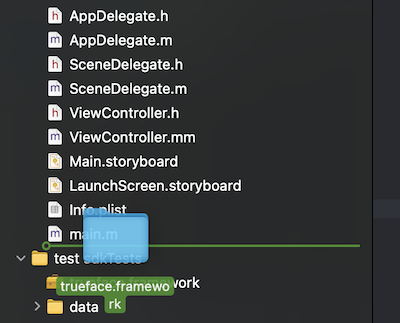
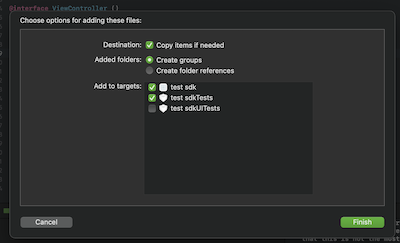

# iOS Guide

The Trueface iOS SDK is distributed as an XCFramework supporting device and simulator on both Apple Silicon and Intel. The Objective-C binding bridges into Swift cleanly — both languages are first-class.

## Requirements

| | |
|---|---|
| Minimum iOS | 12.0 |
| Minimum device | iPhone 6s |
| Distribution | XCFramework (`trueface.xcframework`) |
| Current version | **3.1.1** |
| CoreML | Optional, off by default |

## Install — CocoaPods

Add to your `Podfile`:

```ruby
pod 'trueface', '3.1.1', :source => 'https://github.com/netdur/trueface-libraries-docs/releases/download/v3.1.1-ios/trueface.pods.zip'
```

Then `pod install`.

Add these system frameworks and libraries to **General → Frameworks, Libraries, and Embedded Content**:

- `AVFoundation.framework`
- `CoreMedia.framework`
- `libc++.1.tbd`

## Install — manual XCFramework

1. Download `trueface.xcframework` from the [v3.1.1-ios release](https://github.com/netdur/trueface-libraries-docs/releases/tag/v3.1.1-ios).

2. Drag `trueface.xcframework` into your Xcode project navigator.

   

3. Check **Copy items if needed** and tick your app target.

   

4. Under **General → Frameworks, Libraries, and Embedded Content**, set the framework to **Embed & Sign**.

5. Add `AVFoundation.framework`, `CoreMedia.framework`, and `libc++.1.tbd` in the same panel.

## Using the SDK in Objective-C

Import the binding header where you need it:

```objc
#import <trueface/tf_sdk_binding.h>

TFConfigurationOptions *options = [[TFConfigurationOptions alloc] init];
TFSDK *sdk = [[TFSDK alloc] initWithConfigurationOptions:options];

BOOL ok = [sdk setLicense:@"YOUR_LICENSE_TOKEN"];
if (ok) {
    NSLog(@"licensed, days remaining: %d", [sdk getExpireTime]);
}
```

## Using the SDK in Swift

Create a bridging header so Swift sees the Objective-C binding:

1. **File → New → File → Objective-C File** in your project.
2. Accept the prompt to create the bridging header. The new `.m` file can be deleted; keep the generated `<YourProj>-Bridging-Header.h`.
3. In the bridging header, import the binding:

```objc
#import <trueface/tf_sdk_binding.h>
```

Then from Swift:

```swift
import SwiftUI

let options = TFConfigurationOptions()
let sdk = TFSDK(configurationOptions: options)

let licensed = sdk?.setLicense("YOUR_LICENSE_TOKEN") ?? false
if licensed, let days = sdk?.getExpireTime() {
    print("days remaining:", days)
}
```

The Objective-C method `detectSpoofInImage:withFaceBoxAndLandmarks:threshold:` becomes `detectSpoof(in:with:threshold:)` in Swift — see [Objective-C / Swift](/v3.0/ios/objc) for the full bridge naming rules.

## Models

Place your `.enc` model files in your app bundle, then point `modelsPath` at the bundle resources directory:

```objc
TFConfigurationOptions *options = [[TFConfigurationOptions alloc] init];
NSString *resources = [[NSBundle mainBundle] resourcePath];
options.modelsPath = resources;

TFSDK *sdk = [[TFSDK alloc] initWithConfigurationOptions:options];
```

```swift
let options = TFConfigurationOptions()
options?.modelsPath = Bundle.main.resourcePath
let sdk = TFSDK(configurationOptions: options)
```

## Database location

`createDatabaseConnection:` accepts an absolute filesystem path. Use the app's Library directory for an SDK-managed database:

```objc
NSArray *paths = NSSearchPathForDirectoriesInDomains(NSLibraryDirectory, NSUserDomainMask, YES);
NSString *libDir = paths.firstObject;
NSString *dbPath = [libDir stringByAppendingPathComponent:@"faces.db"];
[sdk createDatabaseConnection:dbPath];
```

## CoreML

CoreML is supported but off by default. Enable it before constructing the SDK:

```objc
TFConfigurationOptions *options = [[TFConfigurationOptions alloc] init];
options.useCoreML = YES;
```

## Cleanup

`TFSDK` and `TFImage` hold native memory. ARC handles release automatically in most cases — if you need deterministic teardown, call `dealloc` paths via `uninitializeModule:` or release strong references explicitly.

## Sample

The iOS bindings repository includes a 3D spoof detection sample at `3d_spoof/` that wires up `AVDepthData`, the video capture pipeline, and frame validation. It's the recommended starting point.
